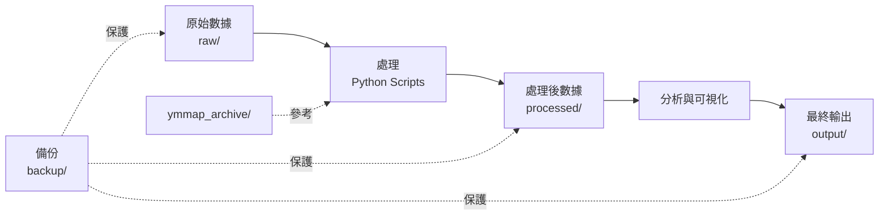

# NQSD 數據管理專案

**交通大學校園數據整理與分析專案**

## 📁 專案概述

本專案包含 NYCU（國立陽明交通大學）各校區的地理空間數據，包括建築物 3D 模型、平面圖、以及相關的處理和分析工具。

## 🗂️ 目錄結構

```
data/
├── 📄 README.md                      # 本文件
├── 📄 CLAUDE.md                      # AI 助手指引
├── 📄 DATA_ORGANIZATION_PLAN.md      # 詳細整理計劃
├── 📄 QUICK_START.md                 # 快速開始指南
├── 🔧 docker-compose.yml             # Docker 編排配置
├── 🔧 Dockerfile.organizer           # 整理工具 Docker 映像
├── 🚀 run_organize.bat               # Windows 運行腳本
├── 🚀 run_organize.sh                # Linux/Mac 運行腳本
│
├── 📂 raw/                           # 原始數據（641 MB）
│   ├── README.md
│   ├── NLSC_3D_tiles/                # 國土測繪中心 3D Tiles
│   │   ├── metadata.json
│   │   ├── 109_A_yangming/           # 109年 陽明校區
│   │   ├── 112_A_yangming/           # 112年 陽明校區
│   │   ├── 112_D_gueiren/            # 112年 歸仁校區
│   │   ├── 112_O_boai/               # 112年 博愛校區
│   │   └── 113_J_liujia/             # 113年 六甲校區
│   └── archive/                      # 舊版本歸檔
│
├── 📂 processed/                     # 處理後的數據（9.7 MB）
│   ├── README.md
│   ├── metadata.json
│   ├── buildings/
│   │   ├── by_campus/                # 按校區分類
│   │   │   ├── boai_NLSC_buildings.json
│   │   │   ├── gueiren_NLSC_buildings.json
│   │   │   ├── liujia_NLSC_buildings.json
│   │   │   └── yangming_NLSC_buildings.json
│   │   ├── combined/                 # 合併數據
│   │   │   ├── NLSC_buildings.json
│   │   │   └── NLSC_buildings.geojson
│   │   └── osm/                      # OpenStreetMap 數據
│   │       └── Guangfu_OSM_buildings.geojson
│   └── building_list.txt
│
├── 📂 output/                        # 最終輸出（1.6 MB）
│   ├── README.md
│   ├── latest/                       # 最新版本
│   │   ├── buildings_3d.geojson      # 3D 建築數據
│   │   ├── buildings_3d.html         # 3D 可視化
│   │   ├── buildings_map.html        # 2D 互動地圖
│   │   ├── buildings_merged.geojson  # 合併的完整數據
│   │   ├── buildings_table.csv       # 建築資料表
│   │   └── buildings_table.xlsx      # Excel 格式
│   ├── v1_2026-02-07/                # 版本化存檔
│   └── archive/                      # 舊版本（壓縮）
│
├── 📂 floor_plans/                   # 平面圖（13 MB）
│   ├── README.md
│   ├── metadata.json
│   ├── pdf/
│   │   ├── auditorium/               # 禮堂
│   │   ├── buildings/                # 建築物
│   │   ├── campus/                   # 校園地圖
│   │   └── administrative/           # 行政文件
│   └── preview/                      # PNG 預覽圖
│
├── 📂 ymmap_archive/                 # 歷史歸檔（3.4 GB）🔒
│   ├── api_data/                     # API 數據
│   ├── building_images/              # 建築圖片
│   ├── building_photos_v2/           # 建築照片 v2
│   ├── floor_plans/                  # 平面圖
│   ├── wfs_data/                     # WFS 數據
│   └── ... （僅供參考，不可修改）
│
├── 📂 backup/                        # 備份目錄
│   ├── backup_YYYYMMDD_HHMMSS/       # 時間戳備份
│   └── backup_YYYYMMDD_HHMMSS.tar.gz # 壓縮備份
│
└── 📂 scripts/                       # 工具腳本
    ├── organize_data.py              # 數據整理工具
    ├── validate_organization.py      # 驗證工具
    └── backup_data.py                # 備份工具
```

## 🎯 數據整理規範

本專案參考 `ymmap_archive/` 的歸檔模式，採用以下最佳實踐：

### ✅ 分層組織
- **一級**: 按功能/數據類型（raw, processed, output）
- **二級**: 按校區/版本（by_campus, v1_2026-02-07）
- **三級**: 具體數據文件

### ✅ 版本控制
- 所有輸出都有時間戳版本
- `latest/` 符號連結指向最新版本
- 舊版本壓縮歸檔節省空間

### ✅ 元數據管理
- 每個目錄都有 `README.md` 說明
- `metadata.json` 記錄處理參數和來源
- 完整的數據血緣追蹤

### ✅ 命名規範
- 使用下劃線分隔: `NLSC_buildings.json`
- 包含類型後綴: `_full.json`, `_stats.json`
- 按校區分類: `yangming_`, `boai_`

## 🚀 快速開始

### 方法 1: 使用一鍵腳本（推薦）

**Windows:**
```cmd
run_organize.bat
```

**Linux/Mac:**
```bash
./run_organize.sh
```

### 方法 2: 使用 Docker Compose

```bash
# 完整流程
docker-compose run --rm backup-creator    # 1. 創建備份
docker-compose run --rm data-organizer    # 2. 執行整理
docker-compose run --rm data-validator    # 3. 驗證結果
```

### 方法 3: 直接使用 Python

```bash
# 安裝依賴
pip install pandas geopandas shapely folium openpyxl rich

# 執行整理
python scripts/organize_data.py
```

📖 **詳細說明請參考**: [QUICK_START.md](QUICK_START.md)

## 📊 數據統計

| 目錄 | 大小 | 文件數 | 說明 |
|------|------|--------|------|
| `raw/` | 641 MB | 713+ | 原始 3D Tiles 數據 |
| `processed/` | 9.7 MB | 8 | 處理後的建築數據 |
| `output/` | 1.6 MB | 6 | 最終可視化結果 |
| `floor_plans/` | 13 MB | 12 | 平面圖和預覽 |
| `ymmap_archive/` | 3.4 GB | 數千+ | 歷史歸檔（只讀）|

**總計**: ~4.06 GB

## 🔧 工具說明

### 1. organize_data.py
**功能**: 整理所有數據目錄，建立規範化結構
- 按校區分類 processed/ 數據
- 為 output/ 建立版本控制
- 分類 floor_plans/ 按類型
- 生成所有元數據和 README

### 2. validate_organization.py
**功能**: 驗證整理後的數據結構
- 檢查必要文件和目錄
- 驗證元數據格式
- 確認 ymmap_archive/ 未被修改
- 生成驗證報告

### 3. backup_data.py
**功能**: 創建完整備份
- 備份所有工作目錄
- 創建壓縮歸檔
- 支援還原功能

## 📚 重要文檔

| 文檔 | 說明 |
|------|------|
| [DATA_ORGANIZATION_PLAN.md](DATA_ORGANIZATION_PLAN.md) | 詳細的整理計劃和實施步驟 |
| [QUICK_START.md](QUICK_START.md) | 快速開始指南和故障排除 |
| [CLAUDE.md](CLAUDE.md) | AI 助手使用指引 |
| `raw/README.md` | 原始數據說明 |
| `processed/README.md` | 處理數據說明 |
| `output/README.md` | 輸出文件說明 |
| `floor_plans/README.md` | 平面圖索引 |

## ⚠️ 重要注意事項

### 🔒 ymmap_archive/ 目錄
- **絕對不可修改**: 此目錄包含歷史歸檔數據
- **僅供參考**: 作為歸檔模式的範例
- **已設為只讀**: Docker 掛載時使用 `:ro` 選項

### 💾 備份策略
- **整理前必備份**: 避免數據丟失
- **定期備份**: 重要操作前都應備份
- **壓縮舊備份**: 節省磁碟空間

## 🛠️ 系統需求

- **Docker**: 20.10+
- **Docker Compose**: 2.0+
- **磁碟空間**: 至少 5 GB 可用
- **記憶體**: 建議 4 GB+

## 📈 處理流程



## 🔍 數據來源

- **NLSC 3D Tiles**: 國土測繪中心
- **OpenStreetMap**: 開放街圖光復校區數據
- **Floor Plans**: 校方提供的平面圖
- **ymmap_archive**: 歷史 ymmap 系統歸檔

## 📞 問題回報

如遇到問題，請檢查：
1. 驗證工具輸出
2. `organization_report_*.json`
3. Docker 容器日誌
4. 各目錄的 README.md

## 📝 更新記錄

### 2026-02-08
- ✅ 創建完整的數據整理工具集
- ✅ 建立 Docker 容器化方案
- ✅ 編寫詳細文檔和使用指南
- ✅ 參考 ymmap_archive 建立最佳實踐
- ✅ 實現自動化備份和驗證

## 📄 授權

本專案為 NYCU 內部使用，數據版權歸屬相關單位。

---

**專案維護**: NQSD Team
**最後更新**: 2026-02-08
**工具版本**: 1.0.0
